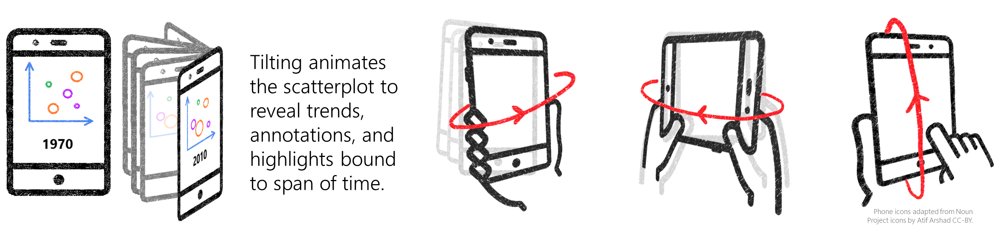
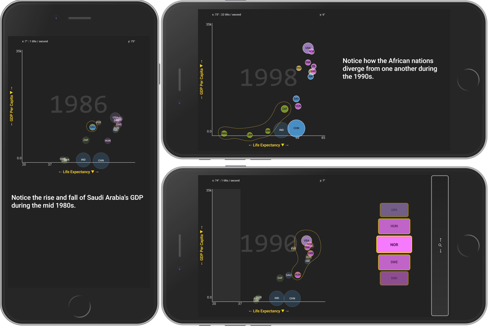

# Tilt Interaction For Mobile Visualization

A demonstration of orientation, tilt, and gesture based interaction with dynamic data visualization on mobile phones by [Matthew Brehmer (Microsoft Research)](mailto:mattbrehmer@gmail.com), [Bongshin Lee (Microsoft Research)](mailto:bongshin@microsoft.com), [Ken Hinckley (Microsoft Research)](mailto:kenh@microsoft.com), and [Christopher Collins (Ontario Tech University)](mailto:Christopher.Collins@uoit.ca). 

## Setup / Testing

1. Open a terminal and navigate to this directory

2. Ensure that [nodejs](https://nodejs.org/) is installed

3. Install the necessary packages with the `npm install` command

4. Start the node server with: `npm start`

5. Open [localhost:8080](http://localhost:8080/) in Chrome. For emulating a mobile usage environment, launch the Chrome debugger (`CTRL + SHIFT + J`) and toggle the device emulator (`CTRL + SHIFT + M`); select your desired mobile device. Note that the application will only be visible in portrait mode in the mobile emulator. 

# Contributing

This project welcomes contributions and suggestions.  Most contributions require you to agree to a
Contributor License Agreement (CLA) declaring that you have the right to, and actually do, grant us
the rights to use your contribution. For details, visit https://cla.microsoft.com.

When you submit a pull request, a CLA-bot will automatically determine whether you need to provide
a CLA and decorate the PR appropriately (e.g., label, comment). Simply follow the instructions
provided by the bot. You will only need to do this once across all repos using our CLA.

This project has adopted the [Microsoft Open Source Code of Conduct](https://opensource.microsoft.com/codeofconduct/).
For more information see the [Code of Conduct FAQ](https://opensource.microsoft.com/codeofconduct/faq/) or
contact [opencode@microsoft.com](mailto:opencode@microsoft.com) with any additional questions or comments.
